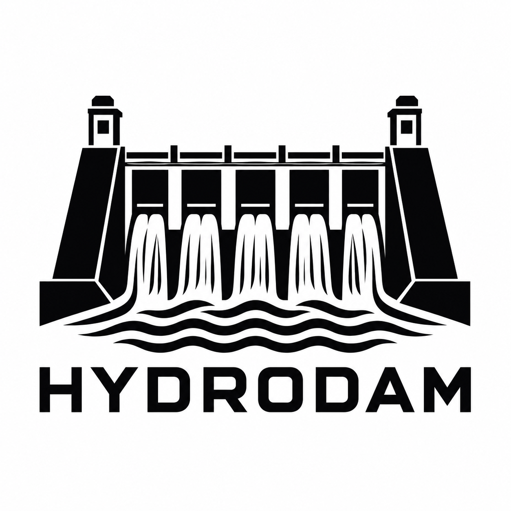

<div align="center">



# Hydrodam

**A safer git desktop client. Commit as the right person, see exactly what you are about to commit, and catch anything that tampers with it before it lands.**

[](LICENSE)
[](https://github.com/DAS-TIN/hydro-dam/stargazers)
[](https://github.com/DAS-TIN/hydro-dam/issues)
[](https://github.com/DAS-TIN/hydro-dam/commits)
[](#features)

[Quick start](#quick-start) &middot; [How to use](#how-to-use) &middot; [How it compares](#how-it-compares) &middot; [Features](#features) &middot; [Contributing](#contributing)

</div>

---

## What is Hydrodam?

Hydrodam is an open-source desktop git client built directly on the real `git` CLI. Every button is a real git command your terminal would run too, so nothing is hidden or magic. On top of that it adds the two things a plain client does not give you: guardrails and visibility.

Ever pushed a commit and only then noticed it went out under the wrong name or email? That is the kind of mistake Hydrodam exists to stop. It keeps work, personal, and client identities straight, shows you the exact files, author, co-authors, and message before a commit lands, and stops the commit cold if a hook, script, or background tool touches the repo between your review and the moment it is written.

It is a GitHub Desktop style app with the depth of a power tool and a few tricks nobody else has.

---

## Quick start

```bash
# 1. Clone and install
git clone https://github.com/DAS-TIN/hydro-dam
cd hydro-dam
npm install

# 2. Run the hot-reloading dev build
npm run dev
```

Run the built app without the dev server:

```bash
npm run build     # bundles main, preload and renderer into out/
npm run preview   # runs that build
```

Build a distributable you can double-click:

```bash
npm run package   # electron-builder writes installers to dist/
```

`package` builds for the OS you run it on: a Windows installer (`.exe`) plus a portable `.exe`, a macOS `.dmg`, or a Linux `.AppImage`, all in `dist/`. Install or run that and Hydrodam opens like any normal app.

Requirements: Node 20+ and `git` on your PATH. Optional integrations use `git-lfs`, provider tokens (GitHub / GitLab / Bitbucket / Azure), and an API key if you want the AI assist.

---

## How to use

1. **Open a repo.** From the welcome screen pick **Open repository**, or **New repository** to `git init` a folder (optionally cloning a URL, including through a connected account for private repos).
2. **Set who you commit as.** The `Committing as Name <email>` strip sits above the commit box and turns red if no identity is set. Click it to keep Work / Personal / client profiles and swap the active one in a click.
3. **Stage and review.** Stage files, hunks, or single lines. Hit **Review** to see every staged file with +/- counts, the author, the co-authors, and the full message with trailers exactly as it will be written.
4. **Commit with a guard.** The moment you commit, Hydrodam re-fingerprints the repo and stops you if anything changed since you reviewed, so nothing can slip edits in behind your back.
5. **Review before you push.** Hit **Review** next to Push to see the outgoing commits, their file changes, and their co-authors before anything leaves your machine.

---

## Keyboard driving

The whole loop works without a mouse. Press **Tab** and a hint strip appears showing where the focus is and which keys work there.

- **Tab** cycles the panels: sidebar, file list, main view, commit box, top bar. Arrows move inside a panel.
- Single letters are contextual and never fire while you type. With the file list focused: **s** stages or unstages, **a** stages everything, **Enter** opens the diff, **c** jumps to the commit message. In the diff: **d / f / p** switch views, **b** blame, **h** history, **t** flips unified/split.
- **Ctrl+Enter** commits, **Ctrl+P** pushes, **Ctrl+Shift+L** pulls, **Ctrl+F** fetches. These live in the app menu too.
- **z** and **Shift+Z** undo and redo staging operations. The status bar keeps the log.
- **Ctrl+Tab** locks Tab inside the focused panel. **Ctrl+Shift+Tab** opens ultra focus, where one view takes the whole window (repo actions, file list, graph, or commit) with a dock at the bottom; **Shift+Left/Right** hop between them and **Esc** backs out.
- **?** opens the full cheat sheet.

---

## How it compares

Legend: **Yes** = built in, **Limited** = partial, manual, or paid, **No** = not available

| Feature | Hydrodam | GitHub Desktop | GitKraken | git CLI |
| --- | :---: | :---: | :---: | :---: |
| Free and open source (Apache-2.0) | Yes | Yes | No (paid tiers) | Yes |
| Identity profiles and "commit as" switch | Yes | No | Limited (paid) | Limited (manual config) |
| Co-author roster with toggles | Yes | Limited (type trailer) | No | Limited (manual) |
| Pre-commit change / injection guard | Yes | No | No | No |
| Commit preview before committing | Yes | Limited (basic) | Yes | Limited (manual) |
| Commit graph across all branches | Yes | Limited (single branch) | Yes | Limited (`log --graph`) |
| Interactive rebase GUI | Yes | No | Yes (paid) | Limited (`rebase -i`) |
| Hunk and line staging | Yes | Limited (lines) | Yes | Yes (`add -p`) |
| 3-way merge resolver | Yes | No | Yes (paid) | Limited (`mergetool`) |
| Worktrees | Yes | No | Limited | Yes |
| Submodules | Yes | No | Yes | Yes |
| Git LFS | Yes | Yes | Yes | Yes |
| PRs / MRs: GitHub, GitLab, Bitbucket, Azure | Yes | Limited (GitHub only) | Yes (paid) | Limited (`gh` / `glab`) |
| Issues and Jira / Trello trackers | Yes | No | Limited (Jira, paid) | No |
| Multiple accounts per provider | Yes | Limited | Yes | Limited |
| Built-in AI (commit msg, review, conflicts) | Yes (bring your key) | No | Limited (paid) | No |
| MCP server for AI agents | Yes | No | No | No |
| Blame view | Yes | Limited (web) | Yes (paid) | Yes |
| Reflog-backed undo | Yes | Limited (undo last) | Yes | Yes |
| Cloud sync / teams | No (local only) | Limited | Yes | No |

> Comparison reflects the free experience of each tool at the time of writing. GitKraken gates much of its power behind paid tiers; GitHub Desktop is free but deliberately minimal.

---

## Features

### Identity and co-authors
- **Commit as the right person.** Identity profiles (Work, Personal, a client) with a one-click active switch, applied to the repo or globally via `git config user.*`. The strip above the commit box turns red when no identity is set.
- **Co-author roster.** Toggle collaborators on and off; enabled ones are appended as `Co-Authored-By` trailers automatically. Hydrodam also suggests co-authors it finds in history.

### Pre-commit injection guard
On commit, Hydrodam re-fingerprints the repo (porcelain status, working diff, and staged diff) and blocks with a "STOP: changes detected" alert if anything moved since you reviewed. What you reviewed is exactly what gets committed; a hook or script that edits files in that window gets caught.

### See exactly what you commit and push
- **Commit preview.** Before committing, see the staged files with +/- counts, the resolved author and co-authors, and the full message with trailers.
- **Push preview.** Review the outgoing (unpushed) commits, their file changes and co-authors, and amend the tip commit's message or co-authors right there.

### History, diffs and blame
- Branch graph across all branches with coloured lanes and ref chips; full commit preview (`git show --stat -p`), message, author, date and per-file +/-.
- Syntax-coloured diffs with word-level highlighting and a Unified / Split toggle; hunk and line staging (like `git add -p`).
- Per-file history, "view previous version", and line-by-line blame.

### Power tools without the terminal
- Interactive rebase (reorder / pick / reword / squash / fixup / drop), cherry-pick, revert, soft/mixed/hard reset, and drag-a-branch-chip-onto-a-commit gestures.
- 3-way merge resolver (Base / Ours / Theirs), worktrees, submodules, sparse-checkout, Git LFS, and reflog-backed undo.
- Image diffs, external difftool/mergetool, "open terminal here", themes, auto-fetch with desktop notifications, and settings export/import.

### Hosting, issues and trackers
- **PRs / MRs** for GitHub, GitLab, Bitbucket and Azure DevOps; connect multiple accounts and switch the active one per provider. Enterprise and self-hosted hosts work too. Tokens stay in the main process.
- **Clone through an account** so private repos work, with a browse-your-repos picker.
- **Issues and trackers** for GitHub, GitLab and Bitbucket issues plus Jira and Trello: list them, open them, and start a branch from one. Azure work items are not listed yet.

### Optional AI assist
Add an API key in **Settings -> AI assist** and Hydrodam can draft commit messages, group changes into logical commits, label stashes, review changes for bugs, explain a commit, diff or conflict, generate release notes, and draft PR/MR text. You see each result as a draft and decide what to do with it. Without a key, the AI features stay hidden.

### MCP server for AI agents
Run a small local MCP server (loopback only) and point any MCP client at it. Read tools (`preview_commit`, `show_commit`, `status`, `diff`, `blame`, `conflicts`, and more) are always available; write tools (`commit`, `push`, `resolve_conflict`, ...) only appear in an explicit **Dangerous mode**.

---

## Contributing

Contributions are welcome.

- **Report bugs or request features** by opening an issue.
- **Improve the code** with a pull request (bug fixes, features, or cleanups). Run `npx tsc --noEmit` and `npm test` before pushing.
- **Share feedback** on what feels rough or missing.

---

## Star history

If Hydrodam is useful to you, a star helps other people find it.

<div align="center">
<a href="https://www.star-history.com/?type=date&repos=DAS-TIN%2Fhydro-dam">
<picture>
<source media="(prefers-color-scheme: dark)" srcset="https://api.star-history.com/svg?repos=DAS-TIN/hydro-dam&type=Date&theme=dark" />

</picture>
</a>
</div>

---

## License and credits

Hydrodam is released under the **Apache License 2.0**. See [LICENSE](LICENSE) and [NOTICE](NOTICE) for details. Copyright 2026 Dastin Depta. To cite the project, see [CITATION.cff](CITATION.cff).

All icons and the logo are original artwork made for this project; no third-party icon sets or brand assets are bundled. GitHub, GitLab, Jira and Trello are trademarks of their owners; Hydrodam uses the names only to identify the services it talks to. The JetBrains Mono font (SIL Open Font License 1.1) is loaded from Google Fonts at runtime.

<div align="center">
<sub>Built with Electron, React, TypeScript and Tailwind, on top of the real git CLI.</sub>
</div>
